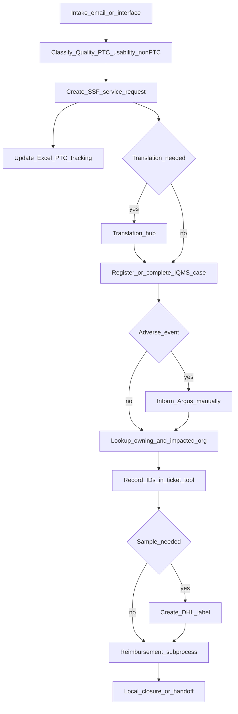

# As-is process

Consolidated from PTC shadowing (Poland 2026-05-07, Costa Rica 2026-05-08). This is **today’s** process. Gaps and site differences are called out rather than smoothed over.

## High-level flow

## 1. Intake

- Email arrives, or a case is created via a Miidas–IQMS interface.
- Emails may include scans or electronically filled complaint forms (sales representative). Different senders use different forms.
- Costa Rica: Andres filters the ticket tool directly for emails. Address patterns (for example PTC-USA) indicate origin.

## 2. Classification / triage

- Decide: quality, PTC, usability / non-PTC.
- Costa Rica: create a service request **in any case** (PTC and non-PTC).
- Triage may already be done (example: assigned to Usability USA).
- Canada/USA volume noted as about 16,000 cases per year with a repeating process.
- One colleague triages interface-created cases and forwards PTCs by creating an SSF service request so the case can be followed up.

## 3. Service request (SSF)

- Create a service request from a template.
- A service request number is created.
- The template supports categorization (triage).

## 4. Tracking

- Excel spreadsheet is used as a PTC tracking tool (duplicates, complaint ratio).
- Country–product lists live in Excel / SharePoint (GBS).

## 5. Translation

- If the handler speaks the language (example: German), they may translate directly.
- Otherwise translation is required.
- Italian example: sent to translation hub; machine translation plus human check; no certification required. Attachment contains original and translation. Text may be on photos, screenshots, and scans.

## 6. IQMS case

- Register the PTC in IQMS when the initial email already contains the needed information.
- Choose the correct template (example: Mirena failed insert, prefilled). Title may contain lot number and ticket ID.
- Copy identifiers from the form (example: Miidas number).
- Fill description of the issue.
- Check product list / product category. Consumer Health uses Synaps; Pharma requests the same kinds of information.
- Risk classification is set (example: low).
- IQMS generates an ID. That ID is entered into the ticket system.
- Attachments are renamed and stored with the IQMS ID.
- Create the person (for example physician) and add attachments that contain sensitive personal data to the confidential person section.
- Add batch number and error code.
- When the Miidas interface already created the IQMS case, many fields may still need manual population if a template cannot be used.

## 7. Adverse event (AE)

- If AE = yes: inform Argus **manually** and report the Argus number.
- Usability issue together with AE is forwarded to PV.
- AE may already have been forwarded (AE number in the attachment).

## 8. Organizations, people, and master data

- **Owning organisation**: site that investigates — look up in a list / Synaps.
- **Impacted organisation**: look up in Synaps or a product-dependent spreadsheet.
- Responsible person: Synaps and/or SharePoint lists (examples in notes: Paola added to the team; Sascha Bürkle).
- Approver may be the same person who registered the case, so the complaint comes back to them.
- Pharmacy address and similar data are copied between systems.

## 9. Ticket tool and subprocesses

- Record complaint ID and batch ID in the ticket tool.
- Subprocesses in the ticket tool include:
  - email to pharmacy
  - reimbursement
  - DHL sample request
- Costa Rica / US Mirena example: close the ticket when there is no recharge; reimbursement is done by the US department.
- IQMS may use an abbreviated workflow: check, then local closure.

## 10. Reimbursement and samples

- Pharmacies get a voucher. Customers may receive a replacement product or must contact their pharmacy.
- Sample requested only if needed for investigation; then generate a DHL label.

## Open questions

- Exact names and owners of the ticket tool, SSF, and tracking workbook
- Whether Consumer Health vs Pharma paths diverge beyond Synaps
- Which steps are in scope for the first n8n automation (translation, categorization, extraction were mentioned in a system-landscape MVP diagram)
