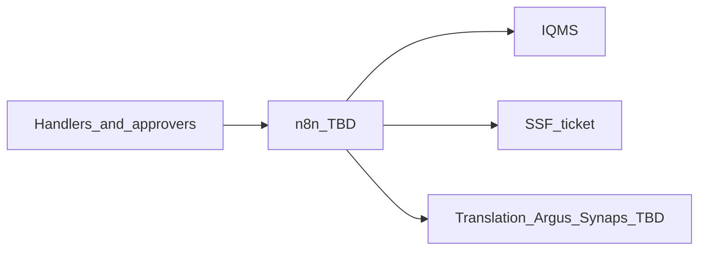

# Architecture

Status: not started.

## Context

_Who uses the system, and which external systems it talks to._

## Containers

_TBD_

## Environments

_TBD_

## Open architecture questions

- Where n8n runs (Bayer-hosted vs other)
- How n8n authenticates to IQMS, SSF, mail, translation
- Human approval gates
